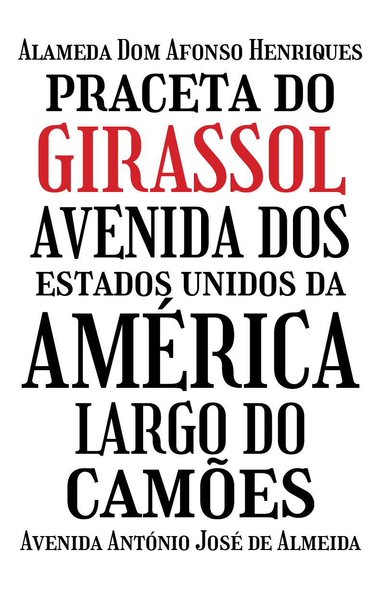

# Girassol

## Description
Girassol is an all-caps + small-caps display typeface inspired by the lettering on hand-painted street signs in and around
Carcavelos, Portugal. It is strengthened and unified by aesthetic sensibility developed in
observation of historical references and a variety of sign lettering around the region.

The primary characteristics that define Girassol include its condensed proportions, moderate
contrast following the expansion model, a thorny, decorative serif construction that pierces the
baseline and cap height, and playful flourishes like those on the R, J, K, Q, and figures that mimic the
decoration possible in hand-painted signage.

The typeface is meant to evoke the identity and spirit of the place where I encountered the
inspirational forms, while accounting for my own presence and experiences.

 

## Features
Features include lining numerals, fractions, and some alternates.

## License
Girassol is licensed under the SIL Open Font License v1.1

##Changelog
**1 November 2019 (Liam Spradlin) Girassol v0.01**
* The very first push :)