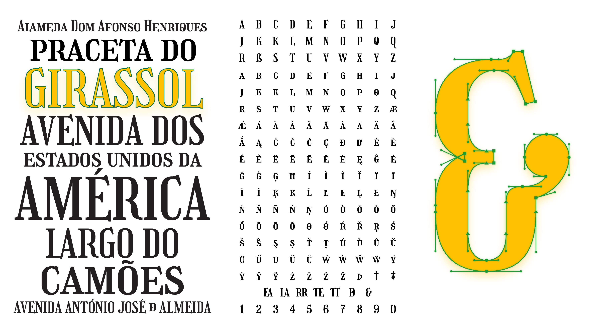

# Girassol

## Description
Girassol is an all-caps (plus smallcaps) display typeface inspired by the lettering on hand-painted street signs in and around
Carcavelos, Portugal.

The primary characteristics that define Girassol include its condensed proportions, moderate
contrast following the expansion model, a thorny, decorative serif construction that pierces the
baseline and cap height, and playful flourishes like those on the R, J, K, Q, and figures that mimic the
decoration possible in hand-painted signage.

The typeface is meant to evoke the identity and spirit of the place where I encountered the
inspirational forms, while accounting for my own presence and experiences.

 

## Features
Features include lining numerals, fractions, discretionary ligatures, and alternates.  

**Default ligatures**
* TT
* RR

**Discretionary ligatures**
* DE
* EA
* LA
* TE
* TT

**Titling**
* Words (up to 5 characters) set in lowercase/smallcaps between words set in caps vertically center

**Alternates**
* J
* K
* Q
* dagger/daggerdbl

## License
Girassol is licensed under the SIL Open Font License v1.1

## Changelog
New changes will be added to the start of this section.

**3 November 2019 (Liam Spradlin) Girassol v0.03/v0.04**  

v0.04
* Cleaned up feature code
* Added alternate Q
* Updated README image
* Revised punctuation and diacritics
* Filled out the rest of the math symbols  

v0.03
* Added new ligatures T/E and E/A
* Organized features
* Added a titling feature that elevates smallcap words set between cap words  
* Updated .notdef :)

**2 November 2019 (Liam Spradlin) Girassol v0.02**
* Added OpenType features to support discretionary ligatures and alternates
* Tweaked a few ligatures (see [commit](https://github.com/liamspradlin/Girassol-Display/commit/4c376973bc137e80c2c7804e64dde87827e29d92))

**1 November 2019 (Liam Spradlin) Girassol v0.01**
* The very first push :)
